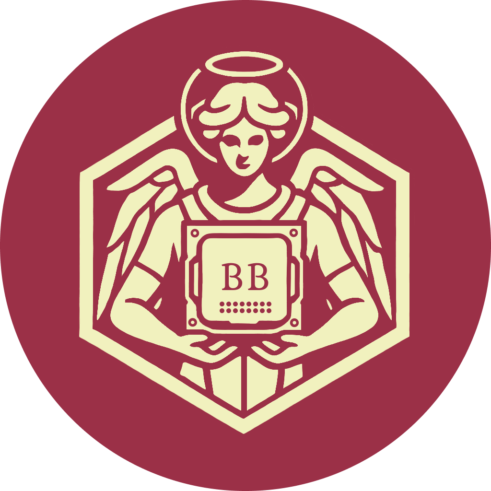

# 👥 **Binary Benefactors**

  
    

## 📑 Оглавление
- [👥 О нас](#-о-нас)
- [🎯 Наша миссия](#-наша-миссия)
- [👨‍👩‍👧‍👦 Наша команда](#-наша-команда)
- [💼 Наши проекты](#-наши-проекты)
   - [🔗 Основные проекты](#-основные-проекты)
   - [🚀 Будущие проекты](#-будущие-проекты)
- [🛠 Технологии и инструменты](#-технологии-и-инструменты)
- [🌟 Ценности и культура](#-ценности-и-культура)
- [🏆 Наши достижения](#-наши-достижения)
- [💬 Отзывы клиентов](#-отзывы-клиентов)
- [🤝 Присоединиться к нам](#-присоединиться-к-нам)
- [📄 Лицензия](#-лицензия)
- [📞 Свяжитесь с нами](#-свяжитесь-с-нами)
- [❓ Часто задаваемые вопросы](#-часто-задаваемые-вопросы)
- [🙏 Благодарности](#-благодарности)

## 🚀 О нас

Мы — неопытная, но активная команда разработчиков, объединённых страстью к созданию современных веб-приложений. 
Наш коллектив сочетает в себе разнообразные навыки и опыт, что позволяет нам эффективно решать задачи и воплощать инновационные идеи в жизнь. 
Мы стремимся к постоянному росту и совершенствованию, стараясь предлагать нашим клиентам качественные и надёжные решения.

## 🎯 Наша миссия

Создавать эффективные и инновационные веб-решения, которые помогают нашим клиентам достигать их целей. 
Мы используем передовые технологии и лучшие практики разработки, чтобы обеспечивать высокое качество и надёжность наших продуктов.

## 👨‍👩‍👧‍👦 Наша команда

### **Ягольник Даниил Сергеевич**
*Team Chief, Chief Backend Developer, Content Manager, Full Stack Developer*  

Даниил отвечает за все нововведения, фичи и идеи, ведёт проект и обеспечивает его развитие.

**Основные обязанности:**
- **Координация команды**: Координирует работу всей команды.
- **Backend разработка**: Руководит разработкой серверной части наших приложений, обеспечивая надёжную архитектуру и высокую производительность.
- **Поддержка Frontend и UX/UI**: Также помогает во фронтенд и UX/UI частях.

---

### **Скубриев Роман Владимирович**
*Project Manager, DevOps-инженер*  

Роман обеспечивает эффективную работу команды, словно дороги в городе. 

**Основные обязанности:**
- **Помощь руководителю проекта**: Разделяет нагрузку с *Team Chief*, дабы снизить нагрузку
- **Оптимизация рабочих процессов**: Способствует тому, чтобы все части команды работали слаженно и продуктивно.
- **Поддержка инфраструктуры**: Обеспечивает бесперебойную инфраструктуру и оптимизирует рабочие процессы.

---

### **Батычков Вячеслав Геннадьевич**
*Backend Developer, QA Engineer*  

Разработчик с хорошими знаниями в backend-разработке и обеспечении качества. 

**Основные обязанности:**
- **Создание серверных решений**: Ответственен за создание надёжных серверных решений.
- **Тестирование приложений**: Гарантирует стабильность и производительность наших приложений.

---

### **Долбин Матвей Сергеевич**
*Frontend Developer, UX/UI Designer*  

Матвей сочетает в себе навыки фронтенд-разработки и дизайна пользовательского интерфейса. 

**Основные обязанности:**
- **Создание интерфейсов**: Отвечает за создание интуитивно понятных и привлекательных интерфейсов для наших веб-приложений.
- **Улучшение пользовательского опыта**: Обеспечивает отличный пользовательский опыт.

---

### **Лавров Даниил Эдуардович**
*Chief Frontend Developer, ML Engineer*  

Даниил является главным фронтенд-разработчиком команды. 

**Основные обязанности:**
- **Архитектура интерфейсов**: Отвечает за архитектуру и реализацию пользовательских интерфейсов, обеспечивая высокое качество и производительность фронтенд-части наших приложений.
- **Интеграция ML-решений**: Активно участвует в разработке и интеграции решений машинного обучения, делая наши приложения более интеллектуальными и функциональными.
- **Внедрение современных технологий**: Его глубокие знания и опыт позволяют внедрять современные технологии и лучшие практики в разработку.

---

### **Одинцов Дмитрий Максимович**
*Chief ML Engineer*  

Дмитрий обладает обширными знаниями в области бэкенд-разработки и в настоящее время занимает позицию Chief ML Engineer. 

**Основные обязанности:**
- **Разработка ML-моделей**: Отвечает за разработку и внедрение моделей машинного обучения, которые улучшают функциональность наших продуктов.
- **Персонализация опыта пользователей**: Предоставляет пользователям более персонализированный опыт.
- **Интеграция ML в backend**: Его опыт в бэкенд-разработке позволяет эффективно давать советы по интегрировации ML-решения в серверную часть приложений.
- **Советчик в серверной части**: Благодаря широким познаниями, даёт прошенные советы backend разработчикам.

<!-- Добавьте остальных членов команды аналогичным образом -->

<!-- Добавьте остальных членов команды аналогичным образом -->

## 💼 Наши проекты

### 🔗 **Основные проекты**

| Проект                | Описание                                      | Технологии                 | Ссылка                      |
|-----------------------|-----------------------------------------------|----------------------------|-----------------------------|
| [Obscura](https://github.com/BinaryBenefactors/obscura-project) | Веб-приложение для блюра объектов. | React, Go, PostgreSQL, Python       | [Демо](https://demo1.com)   |
| [Проект 2](https://github.com/ваша_организация/проект2) | Мобильное приложение для фитнеса.         | React Native, Node.js       | [Демо](https://demo2.com)   |

### 🚀 Будущие проекты

Мы активно работаем над расширением нашего портфолио, включая выполнение разнообразных freelance-заказов — от небольших веб-приложений до масштабных проектов. Следите за обновлениями, чтобы не пропустить наши новые достижения!

## 🛠 Технологии и инструменты

Мы используем широкий спектр технологий и инструментов для обеспечения качественной разработки:

### **Frontend:**
- 
- 
- 
- 
- 
- 
- 

### **Backend:**
- 
- 
- 

### **Machine Learning:**
- 
- 
- 

### **UX/UI Дизайн:**
- 
- 
- 

### **DevOps:**
- 
- 
- 

### **Базы данных:**
- 
- 
- 

### **Другие языки и технологии:**
- 

## 🌟 Ценности и культура

Мы ценим:

- **Качество:** Стремление к безупречным решениям.
- **Сотрудничество:** Эффективная командная работа.
- **Инновации:** Внедрение новых технологий и методов.
- **Развитие:** Постоянное обучение и профессиональный рост.
- **Ответственность:** Надёжность и выполнение обязательств перед клиентами.

## 🏆 Наши достижения

- **0+** успешно выполненных freelance-заказов
- **1** веб-приложений в портфолио
- **5** наград за лучшие проекты в институте

## 💬 Отзывы клиентов

> "Отличная команда профессионалов! Быстро и качественно выполнили наш проект."  
> *— Клиент A*

> "Результат превзошёл ожидания. Рекомендую!"  
> *— Клиент B*

## 🤝 Присоединиться к нам

Мы всегда открыты для сотрудничества с опытными специалистами! Если вы энтузиаст, стремящийся развиваться в сфере разработки веб-приложений и обладаете необходимыми навыками, свяжитесь с нами.

**Важно:** В данный момент мы не ищем новичков, но всегда готовы рассмотреть предложения от опытных специалистов.

📫 **Контакты:**  
- **Email:** [пока нет](mailto:your-email@example.com)  
- **Telegram:** [пока нет](https://t.me/yourtelegram)  
- **LinkedIn:** [пока нет](https://linkedin.com/in/ваш-профиль)  

## 📄 Лицензия

Для каждого отдельного проекта уточняйте лицензию в его репозитории.

## 📞 Свяжитесь с нами

Если у вас есть вопросы или предложения, не стесняйтесь обращаться!

## ❓ Часто задаваемые вопросы

**Вопрос 1:** Как я могу стать частью вашей команды?  
<!-- **Ответ:** Мы открыты для сотрудничества с опытными специалистами. Свяжитесь с нами через [контакты](#-присоединиться-кнам). -->
**Ответ:** Мы пока закрыты для сотрудничества. В процессе нашего развития нам понадобятся дополнительные силы. Связаться вы с нами сможете через [контакты](#-присоединиться-кнам).

**Вопрос 2:** Какие проекты вы принимаете?  
**Ответ:** Мы принимаем проекты в области веб-разработки, стараясь использовать современные технологии и подходы.

## 🙏 Благодарности

- [OpenAI](https://openai.com) за создание ChatGPT
- [GitHub](https://github.com) за платформу для совместной разработки
- [Binary Benefactors](https://clck.ru/3CC6jE) за лучшие решения
